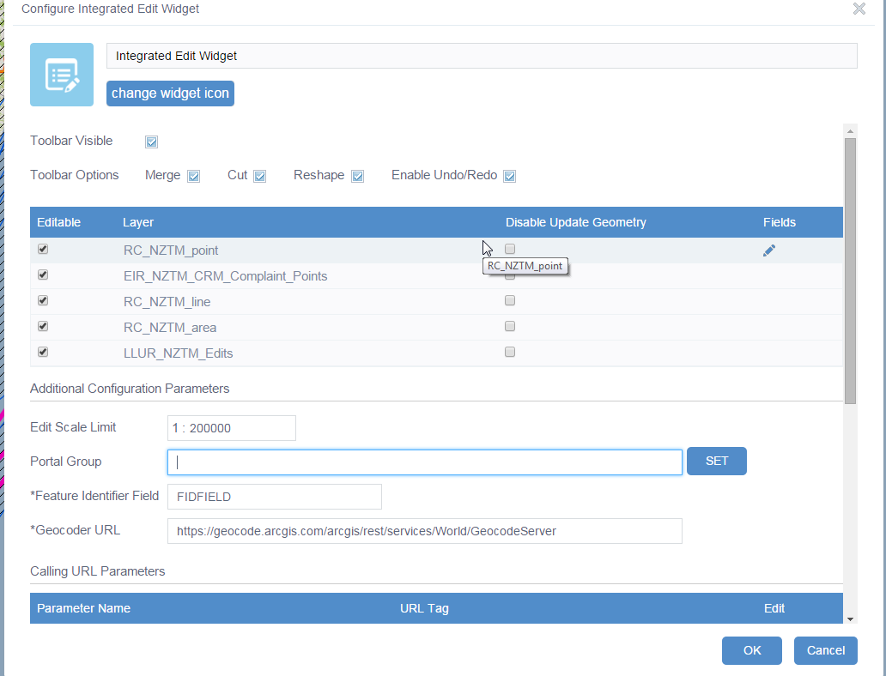
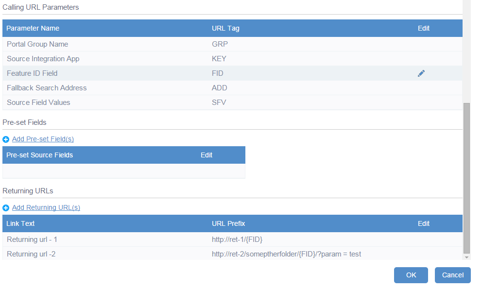
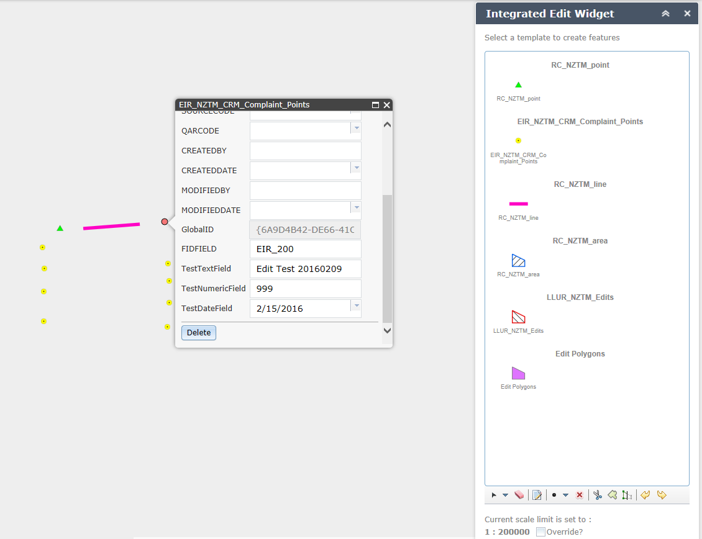
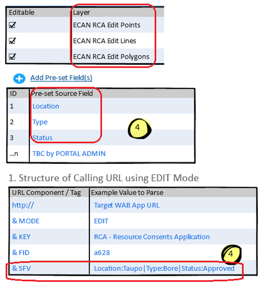
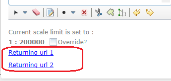
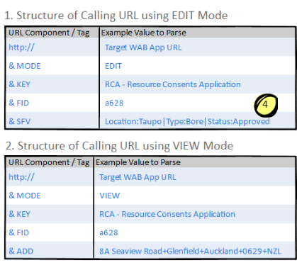

# Edit (Integrated Edit) widget #
*Topic Last Updated: 14/03/2016*

**Primary purpose:**

- To enable a Target Web Application (TWA) to be called from a Source Integration Application (SIA) at a Feature of Interest in Edit or View Mode, then re-open the integrated application on completion of editing or viewing. 
## GBS WAB Widget Demo ##
Contact [GBS](http://gbs.kiwi/) for access to the Custom Tool Demo site.

## Widget Description ##
Integrated Edit Widget

### IP Owner & Product Name ###
3 x GISCO Members:
<ul>
	<li>Environment Canterbury Regional Council (ECAN),</li>
	<li>Palmerston North City Council (PNCC), and</li>
	<li>Greater Wellington Regional Council (GWRC)</li>
</ul>

### Customisation Description ###
This product EXTENDS the OOTB Web AppBuilder Edit Widget (WAB v1.3).  It has been customised by GBS to include the following enhancements:
 
#### Controlled Editing Workflow customisation 
The Integrated Edit Widget (IEW) was  designed to primarily provide 3 x GISCO Members: Environment Canterbury (ECAN), Palmerston North City Council (PNCC), and Greater Wellington Regional Council (GWRC) with a controlled editing workflow that:

1. Allows the user to find a feature of interest in a non-GIS application, then open a GIS WAB Application at the relevant location that allows them to create or edit the related feature(s) spatially.  

2. On doing this, specified values are automatically parsed in a Calling URL from the non-GIS application to the GIS Application, and attributed against the new or updated features.  

3. On completing the edits, the user is required to re-open a non-GIS web application and parse through a command, e.g. Commit – which may mean: open the Target Integrated Application (TIA) to show the feature of interest, and save the edits. 
 

The EIW also allows for the TWA to be opened in View Mode, and to parse through a Fallback Search Geocode address to use (if a matching Feature ID cannot be found).  The details of these variations are detailed in the Workflow section of this PD.
 
 
## Options configurable by Client Admin ##

<table>
	<tr>
		<th>ID</th>
		<th>Configurable Option</th>
	</tr>
	<tr>
		<td>1</td>
		<td>Edit Scale Limit
			<ul>
				<li>Enables WAB Admin to set the max scale that users are able to edit features at. </li>
			</ul>
		</td>
	</tr>
	<tr>
		<td>2</td>
		<td>Portal Group
			<ul>
				<li>Enables WAB Admin to add in additional editable layers to the web map OnLoad, that are not already in the configured 'Group'.  </li>
			</ul>
		</td>
	</tr>
	<tr>
		<td>3</td>
		<td>Feature Identifier Field
			<ul>
				<li>Enables WAB Admin to specify the name of the field that contains the unique value of the feature of interest that is being passed to the published app via the Calling URL. </li>
			</ul>
		</td>
	</tr>
	<tr>
		<td>4</td>
		<td>Geocoder URL
			<ul>
				<li>Enables WAB Admin to specify the Fallback Search Geocoding Service that will be used when the &ADD tag is passed via the Calling URL.</li>
			</ul>
		</td>
	</tr>
	<tr>
		<td>5</td>
		<td>Calling URL Parameters
			<ul>
				<li>Parameter Name  & Tag - Enables WAB Admin to specify the URL Tags that will be passed via the Calling URL, e.g. Instead of &ADD, the client may wish to use &GEOCODE.</li>
			</ul>
		</td>
	</tr>
	<tr>
		<td>6</td>
		<td>Calling URL Pre-set Fields
			<ul>
				<li>Enables WAB ADMIN to specify some preset fields that will be parsed via the Calling URL (and potentially reduce the length of the Calling URL).</li>
				<li>If the Calling URL contains the &SFV Tag, all features edited or created in the Editable Layers in the TWA will be calculated to have: 
				<ul>
				<li>Feature ID Field = FIDValue (as parsed by the Calling URL)</li>
				<li>Pre-set Field name 1 to n = SFV1 to n (as parsed by the Calling URL)</li>
				</ul>
				</li>
				<li>It is optional for the Calling URL to include the Field Name as well as the Source Field Values (SFVs)being parsed. </li>
				<li>Example – with Source Field Fieldnames excluded in the Calling URL: 
					<ul>
					<li>&SFV=Taupo|Bore|Approved – this will calculate the values in the Configured pre-set fields (Location, Type and Status) to equal Taupo, Bore and Approved respectively. </li>
					<li>Note: the values being parsed in will be assigned to the pre-set fields in the order they have been set by Portal Admin when configuring the TWA.  If the order is incorrect, the Calling URLS values will still try to be pushed into the pre-set field names.  </li>
					</ul>
				</li>
			</ul>
		</td>
	</tr>
	<tr>
		<td>7</td>
		<td>Returning URLS
			<ul>
				<li>Link Text & URL Prefix - Enables WAB Admin to set 1 to many Returning URLs.  Placeholder text {FID} is used to mark the position in the Returning URL that the current FID value will be inserted. </li>
			</ul>
		</td>
	</tr>
	<tr>
		<td>8</td>
		<td>Related Screenshot:
			
			
		</td>
	</tr>

</table>

 
## Workflow for using the Integrated Edit Widget (EIW) ##
The workflow for the Integrated Edit Widget (IEW) is designed to start from the Source Integration Application (SIA).

When the user has the SIA open: 
 
- On finding an Incident / Record / Consent (feature) of interest (e.g. Consent ID = a628), the user clicks a custom button in the SIA.
- The unique id of the feature of interest is extracted, and forms part of the Calling URL that is generated, e.g. &FID=a628.

On executing the **Calling URL**, the Target Web App (TWA) that matches the ‘Target Web App URL’ will be opened.  The Calling URL structure is as follows:

<table>
	<tr>
		<th>Parameter</th>
		<th>Details</th>
	</tr>
	<tr>
		<td><strong>TWA URL</strong>
		 	This parameter is required.</td>
		<td>
			
It is assumed that the SIA will call a fit-for-purpose TWA that uses a unique URL, and includes:

			<ul>
				<li>The Integrated Edit Widget (IEW).</li>
				<li>All Editable Layers as specified in the configuration for the IEW.  These layers will be SIA-specific, i.e. the TWA needs to contain Edit Layers that relate to the SIA that the Calling URL is generated from, e.g. If SIA = RCA, then the Edit Layers in the TWA will all be RCA / Consent layers.</li>
				<li>OOTB WAB Search Tool to be configured (so that if a feature cannot be found, and the address parsed through does not match, user can still find their location of interest on the map) by manually entering a search term.</li>
			</ul>
		</td>
	</tr>
	<tr>
		<td><strong>Mode (&MODE)</strong>
			This parameter is optional</td>
		<td>
			
If the Calling URL contains &MODE = EDIT, the TWA will be opened in Edit Mode:

			<ul>
				<li>The user is required to follow the controlled Edit workflow from SIA > GIS > TIA </li>
				<li>If the Calling URL contains &MODE = VIEW, the TWA will be opened in View Mode:
					<ul>
						<li>The user may follow their own workflow (the IEW will be available if the user wishes to open it manually), but no Source Field Values will be parsed to any features that are created / edited in the current session.</li>
					</ul>
				</li>
				<li>If the Calling URL does not contain the &MODE Tag (i.e. the TWA is opened manually or using some other method than via the Calling URL):
					<ul>
						<li>The user may follow their own workflow (the IEW will be available if the user wishes to open it manually), but no Source Field Values will be parsed to any features that are created / edited in the current session.</li>
 
						Summary of workflow by MODE: 
						<table>
							<tr>
								<th>Function</th><th>&MODE = EDIT</th><th>&MODE = VIEW</th><th>No &MODE Tag</th>
							</tr>
							<tr>
								<td>IEW Widget</td>
								<td>Will be Open in the Target WAB OnLoad (if configured to be published).</td>
								<td>Will be in the Target WAB OnLoad (if configured to be published), but closed.</td>
								<td>Same as &MODE = VIEW.</td>
							</tr>
							<tr>
								<td>OOTB UI Controls</td>
								<td>Will be as per IEW config when published.</td>
								<td>Same as &MODE = EDIT.</td>
								<td>Same as &MODE = VIEW.</td>
							</tr>							
							<tr>
								<td>Custom UI Controls</td>
								<td>
									

										Edit Scale Limit control will be visible with Over-ride option available. 
									

									

										Returning URLs 1 to n will be displayed when configured by Portal Admin. 
									

								</td>
								<td>No Custom UI Controls will be displayed.</td>
								<td>Same as &MODE = VIEW.</td>
							</tr>						
							<tr>
								<td>Map – if matching FID found</td>
								<td>Will apply Definition Query to all Configured Edit Layers where FID=&FIDValue (e.g. a628), and zoom to the extent of all matching features found.</td>
								<td>Will apply Definition Query to all Configured Edit Layers where FID=&FIDValue (e.g. a628), and zoom to the extent of features found (and highlight these).</td>
								<td>n/a – no &FID tag in Calling URL.</td>
							</tr>								
							<tr>
								<td>Map – if matching FID is not found, but Fallback Address is</td>
								<td>
									
Will apply Definition Query to all Configured Edit Layers where FID=&FIDValue (e.g. a628).

									
Will then use Configured Address GeoCode Service to find address = &ADD.  Once found, map will zoom to matching address.

								</td>
								<td>
									
Will apply Definition Query to all Configured Edit Layers where FID=&FIDValue (e.g. a628).

									
Will then use Configured Address GeoCode Service to find address = &ADD.  Once found, map will zoom to matching address.

								</td>
								<td>n/a – no &FID or &ADD tag in Calling URL.</td>
							</tr>							
							<tr>
								<td>Map – if no &FID or &ADD found</td>
								<td>
									
Will apply Definition Query to all Configured Edit Layers where FID=&FIDValue (e.g. a628)

									
Display modal dialog box asking the user to find their location of interest manually.

								</td>
								<td>
									
Will apply Definition Query to all Configured Edit Layers where FID=&FIDValue (e.g. a628).

									
Display modal dialog box asking the user to find their location of interest manually.

								</td>
								<td>n/a – no &FID or &ADD tag in Calling URL.</td>
							</tr>
						</table>
					</ul>
				</li>
			</ul>
		</td>
	</tr>
	<tr>
		<td><strong>Feature ID Field (&FID)</strong>
		This parameter is required</td>
		<td>
			
This Tag is required, and must be set equal to the unique value of the feature of interest in the SIA when the Calling URL was generated, e.g.

			<ul>
				<li>If the user has the Resource Consents Application open, and is looking at Consent a628, the Calling URL that is generated will contain &FID=a628.</li>
				<li>On opening the TWA, the &FIDValue will be searched for in the configured Feature ID Field in each of the configured Editable Layers, e.g. Consent_ID = a628.</li>
				
Note: if there are multiple Target Edit Layers in the TWA, they are all required to have the same Feature ID Field (in this example: Consent ID). 

			</ul>
			
On opening the TWA, a Definition Query will be applied to all Editable Layers: where FID=&FIDValue 

			
Important Notes:

			<ul>
				<li>This Definition Query will be applied regardless of whether the user is in View or Edit Mode. </li>
				<li>The only time the Definition Query will not be applied is if the Calling URL does not contain a &MODE tag</li>
			</ul>
			
If a feature with a matching FID is found in the Target Edit Layer(s), the TWA will be in Edit Feature Mode, i.e

			<ul>
				<li>The map will zoom to the extent of all the matching features found in all Editable Layers. </li>
				<li>Only the features that have &FID = &FIDValue will be visible on the map (all others will be hidden from view, as the Definition Query will be applied).</li>
				<li>All features edited in the current session will be attributed with the Source Field Values being parsed in the Calling URL from the SIA. </li>
				<li>The user will be able to edit other attributes relating to the feature of interest, as per the existing OOTB Edit Widget behaviour: ‘To edit a feature, click it on the map to open its pop-up and edit the information</li>
				 
				
			</ul>
			
If no feature is found to match the FID in the Target Edit Layer(s), no features in any of the Target Edit Layers will be visible on the map (as Definition Query &FID = &FIDValue will have been applied). 

			
Important Note: ECAN intend to give the users context / awareness of the spatial locations of other existing features by having a 2nd non-editable copy of all Editable Layers in the map (with different symbology) so that the user does not accidentally create a new feature in the same location as an existing one.

			
If no feature is found to match the FID in the Target Edit Layer(s), the TWA will be in Create Feature Mode, i.e.

			<ul>
				<li>If a Fallback Search Address Tag is parsed through and a matching address is found, the map will zoom to the extent of the matching address. </li>
				<li>If no Fallback Address Tag is parsed through or no single matching address is found, the map will stay at the default map extent on load. </li>
				<li>The user will be able to create new features by following the existing OOTB behaviour: ‘To add a feature, click its symbol in the template, and click to add or draw it on the map’. </li>
			</ul>
			
After the user has added a new feature to the map, that feature will be attributed with the Source Field Values that were parsed through from the Calling URL from the SIA.  

			
The OOTB Edit Popup will then appear, and give the user the ability to update any attributes as required. 

		</td>
	</tr>
	<tr>
		<td><strong>Portal Group ID (&GRP)</strong>
			This parameter is optional </td>
		<td>
			
This Tag is included at this stage for future extensibility only, i.e. the GRP tag could be used to load all Edit Layers that are part of that group into the TWA on load (rather than requiring manual inclusion and publishing by Portal Admin as at present). 

		</td>
	</tr>
	<tr>
		<td><strong>Source Integration App (&KEY)</strong> 
			This parameter is optional</td>
		<td>
			
This Tag is included at this stage for future extensibility only, i.e. Certain Config parameters could be hidden / shown to Portal Admin dependent on value, e.g. 

			<ul>
				<li>When &KEY = EIR, the Returning URLs config options are not displayed.</li>
				<li>When &KEY Value = LLUR, the Returning URLs config options are displayed (and available to configure). </li>
			</ul>
		</td>
	</tr>
	<tr>
		<td><strong>Fallback Search Geocode Service (&ADD)</strong>
			This parameter is optional</td>
		<td>
			
If the Calling URL contains the &ADD Tag and a matching FID is not found in any of the Editable Layers in the TWA, the configured Fallback Search Geocode Service (FSGS) will be used.

			
If there are 0 x matching results found in the FSGS– the map will stay at the default map extent on load, and a modal popup dialog will be displayed that says: ‘The location of the feature you are interested in could not be found.  Please use the Search Tool and/or the Map Tools to navigate to your location of interest.’

			
If there is 1 x matching result found in the FSGS – the map will zoom to the extent of the address found, but no graphics will be added to the map (showing the address point), and no popup will be displayed to show any info relating to that address). 

			
If there is > 1 matching result found in the FSGS (note:  it is possible that multiple search terms may be found using the input parsed in the Calling URL 

			
If this happens - the map will stay at the default map extent on load, and a modal popup dialog will be displayed that says: ‘Multiple addresses matched the location you are trying to find.  Please use the Search Tool to narrow down your search and/or use the Map Tools to navigate to your location of interest.’

		</td>
	</tr>
	<tr>
		<td><strong>Source Field Values (&SFV)</strong>
			This parameter is optional </td>
		<td>
			
If the Calling URL contains the &SFV Tag, all features edited or created in the Editable Layers in the TWA will be calculated to have: 

			<ul>
				<li>Feature ID Field = FIDValue (as parsed by the Calling URL)</li>
				<li>Pre-set Field name 1 to n = SFV1 to n (as parsed by the Calling URL) </li>
				<li>Feature ID Field = FIDValue (as parsed by the Calling URL)</li>
			</ul>
			
It will be optional for the Calling URL to include the Field Name as well as the Source Field Values (SFVs)being parsed.

			
Example – with Source Field Fieldnames excluded in the Calling URL: 

			<ul>
				<li>&SFV=Taupo|Bore|Approved – this will calculate the values in the Configured pre-set fields (Location, Type and Status) to equal Taupo, Bore and Approved respectively. </li>
				
Note: the values being parsed in will be assigned to the pre-set fields in the order they have been set by Portal Admin when configuring the TWA.  If the order is incorrect, the Calling URLS values will still try to be pushed into the pre-set field names. 

			</ul>

			
Example – with Source Field Fieldnames included in the Calling URL (where field names parsed in match the pre-set fields in the configured TWA):

			<ul>
				<li>&SFV=Location:Taupo|Type:Bore|Status:Approved – this will calculate the values in the Location, Type and Status Fields to equal Taupo, Bore and Approved respectively. </li>
			</ul>

			
Examples – with Source Field Fieldnames included in the Calling URL (where field names parsed in do not match the pre-set fields in the configured TWA):

			<ul>
				<li>Field order is different: &SFV=Type:Bore|Location:Taupo|Status:Approved – this will calculate the values in the Type, Location and Status fields to equal Bore, Taupo, and Approved respectively (even if the pre-set fields are in a different order), e.g. Location, Type, Status. </li>
				<li>Field names are different: &SFV=Colour:Blue|TLA:NSCC|Material:Concrete – this will calculate the values in the Colour, TLA and Material fields to equal Blue, NSCC, and Concrete respectively (even if the pre-set fields are completely different), e.g. Location, Type, Status, i.e. the field names being parsed in via the Calling URL are the ‘master’. </li>
			</ul>
		</td>
	</tr>
</table>
 
### Edit Scale Limit and Over-ride option  
Regardless of whether the user is in Create Feature Mode or Edit Feature Mode: 

- The Edit Scale Limit as configured by the Administrator will be displayed. 
- If the user tries to edit or create a feature outside the Configured Edit Scale Limit, they will be prevented from doing so, and a message box will be displayed that says: ‘You cannot create or edit any features outside the pre-set Edit Scale Limit of <pre-set Edit Scale Limit>.  To over-ride this limit and be able edit features at any scale, please tick the ‘Over-ride’ checkbox in the Integrated Edit Widget.’ 
- The Over-ride option will be unticked by default. 
- On ticking the Over-ride checkbox, the user will be able to edit/create features at any scale. 
 
#### Important Notes  ####
If there are multiple Editable Layers in the TWA, all of these layers need to contain all of the fields being parsed through in the Calling URL, e.g. 

Using the following configuration settings, the ECAN RCA EDIT Points, ECAN RCA EDIT Lines,  and ECAN RCA EDIT Polygons layers would all need to contain the 3 x configured Pre-set Fields: Location, Type, Status: 

 
- If there are multiple Editable Layers in the TWA, it is assumed that the user will be able to edit any layer they wish by using the OOTB Edit Widget ‘Template selector’ control to pick their layer of interest. 
- Every existing feature that the user chooses to edit, will have any existing values in the Configured Pre-set fields over-written by the Source Field Values being parsed in.  Note: If there are any existing features that the user does not choose to edit in their current session, these features will not have their attributes updated with any values being parsed in by the Calling URL. 
- Users will only be able to Edit features with FID = &FIDValue. 
- Every new feature that the user creates will be assigned FID = &FIDValue, and have their Pre-set Fields set to the parsed &SFV values.   
- Multiple new features can be created in the Target Edit Layers.  All will be assigned the same pre-set values. 
 
When passing parameters for the FID and SFV:   

- Use a text definition of the data rather than a short hand version as this is less likely to be tripped up by region setting issues for dates e.g. **“25 Feb 2016”** instead of  **“25/02/2016” **
- If writing to a GUID field – make sure you pass the parameter including the curly brackets as the search functionality will work correctly, but the features will error when saving because ArcGIS server will not consider it a valid guid.   e.g. **“?MODE=EDIT&FID={F4501F75-30C9-477B-BF0E-69B084FCC803}”** as opposed to **“?MODE=EDIT&FID=F4501F75-30C9-477B-BF0E-69B084FCC803”**  
 
 
### Returning URLs ###
On completing all required edits in the TWA, the user is required to click one of the configured Returning URLs in the IEW: 

On executing the Returning URL, the Target Integration Application (TIA) will be opened in a new browser window.  
 
 
## Dependencies / Pre-Requisite Tasks ##

### Calling URL Setup: ###
The client is required to customise their SIA to generate a Calling URL as structured below:

The URL Components / Tags are defined by Portal Admin when they configure and publish the Target Web Application (TWA):

Note: This has been done so to keep the integration flexible, and allow for existing council functionality / terminology to be retained if required, e.g. Source Field Values will be able to be parsed to the TWA using &SFV or &KEYVALUE or whatever tag reference the Administrator chooses to use.

### Returning URL setup: ###
The client is required to customise their TIA to accept a Returning URL that may include:

			
- The unique id of the feature of interest that was parsed into the TWA from the Calling URL, e.g. &FID = a628.
- A command to execute that relates to the workflow, e.g.
	- Commit Edits - http://internalapps/LLUR/Geometry/CommitEditGeometry/a628
	- Cancel Edits - http://internalapps/LLUR/Geometry/CancelEditGeometry/a628

 
## Reason for Customisation ##

ECAN and the consortium had the following requirements that could not be met using OOTB WAB

<table>
	<tr>
		<th>ID</th>
		<th>Details</th>
	</tr>
	<tr>
		<td>1</td>
		<td><strong>Summary:</strong>
			
ECAN required a controlled editing workflow that enables users to:

			<ul>
				<li>Find a feature of interest in a non-GIS application, then open a GIS WAB Application at the relevant location that allows them to create or edit the related features spatially.</li>	
				<li>On completion of editing, the user can click a Returning open a Target Web Application</li>
			</ul>
		</td>
	</tr>
	<tr>
		<td>2</td>
		<td><strong>Full list of GISCO's Requirements for the IEW:</strong>
			
ECAN required a controlled editing workflow that enables users to:

			<ul>
				<li>Have a mechanism that would allow fields in edited features to be populated automatically with specified values provided from a calling application. Control of this mechanism would need to be a configurable item. </li>	
				<li>Have a mechanism that would allow fields in edited features to be populated automatically with the zoom level that the feature was captured/last modified at. Control of this mechanism would need to be a configurable item.</li>
				<li>Have ability to have an external application open a GIS session, then automatically select and zoom to an existing feature (or features) using a key record, and start the edit session.  An optional parameter should be specified as to whether features that do not match the record key should be displayed or hidden from view. Control of this mechanism would need to be a configurable item. </li>
				<li>Have ability to have an external application open a GIS session, then automatically locate an address (or other locator feature) and zoom to it, and start the edit session.  This must stack with the previous requirement about zooming to an editable feature, with the previous feature taking preference if an editable feature is located.  e.g. if calling application passes through an address and a feature key, the widget would search for an existing feature with that key first, and if one is not located then does the locator search to zoom the map to provided address. </li>
				<li>Have a mechanism to return to/call one or more web pages with configured urls and a specified parameter value as a way of signaling the calling application that something has occurred.  Control of this mechanism would need to be a configurable item.</li>
				<li>Have a mechanism that prevents capturing/modifying features unless the map is zoomed in beyond a configurable scale.  If the map is zoomed out beyond this scale the edit tools should be disengaged.  Optional requirement that user be able to override this scale limitation if necessary (e.g. when the feature being edited is large enough that by default it exceeds the edit limit scale when fully displayed on the map) .  Control of this mechanism would need to be a configurable item. </li>
			</ul>
		</td>
	</tr>
</table>
 
## Possible Future Development Options ##

<table>
	<tr>
		<th>ID</th>
		<th>Details</th>
	</tr>
	<tr>
		<td>1</td>
		<td>The buffer distance applied when “zooming to the extent” of features using a FID parameter should probably be configurable in admin screen as either a fixed distance or a % of the non-buffered extents size.</td>
	</tr>
	<tr>
		<td>2</td>
		<td>Addition of a zoom to current records option in the UI – only visible in EDIT or VIEW mode when a FID is supplied.</td>
	</tr>
	<tr>
		<td>3</td>
		<td>Use standard GIS editing tools and actions, including:
			<ul>
				<li>Split feature</li>			
				<li>Merge features (lines as well as polygons)</li>			
				<li>Reshape feature</li>			
				<li>Autocomplete shape</li>			
			</ul>
		</td>
	</tr>
	<tr>
		<td>4</td>
		<td>Copy features from an existing layer and paste into the edit layer.</td>
	</tr>
	<tr>
		<td>5</td>
		<td>Filter Edit Templates to just those specified in an optional url parameter.</td>
	</tr>
</table>
 
## Glossary of Terms ##

<table>
	<tr>
		<th>Abbreviation</th>
		<th>Description (Reference)</th>
	</tr>
	<tr>
		<td>ADD</td>
		<td>Fallback Search Geocode Service (Calling URL Tag)</td>
	</tr>
	<tr>
		<td>EIR</td>
		<td>Environmental Incident Register (Integration Application)</td>
	</tr>	
	<tr>
		<td>FID</td>
		<td>Feature ID Field (Calling URL Tag)</td>
	</tr>	
	<tr>
		<td>FSGS</td>
		<td>Fallback Search Geocode Service (Calling URL Parameter)</td>
	</tr>	
	<tr>
		<td>GISCO</td>
		<td>Local Government GIS Consortium (Organisation)</td>
	</tr>
	<tr>
		<td>IEW</td>
		<td>Integrated Edit Widget</td>
	</tr>
	<tr>
		<td>KEY</td>
		<td>Source Integration Application Identifier (Calling URL Tag</td>
	</tr>
	<tr>
		<td>LLUR</td>
		<td>Listed Land Use Register (Integration Application)</td>
	</tr>
	<tr>
		<td>OOTB</td>
		<td>Out-of-the-Box</td>
	</tr>
	<tr>
		<td>RCA</td>
		<td>Resource Consent Application (Integration Application)</td>
	</tr>
	<tr>
		<td>SFV</td>
		<td>Source Field Values (Calling URL Tag)</td>
	</tr>	
	<tr>
		<td>SIA</td>
		<td>Source Integration Application</td>
	</tr>	
	<tr>
		<td>TIA</td>
		<td>Target Integration Application</td>
	</tr>	
	<tr>
		<td>TWA</td>
		<td>Target Web Application</td>
	</tr>	
	<tr>
		<td>WAB</td>
		<td>Web AppBuilder</td>
	</tr>	
</table>

 
 

 
 

 
 

 
 

 
 

 
 

 
 
 
 
 
